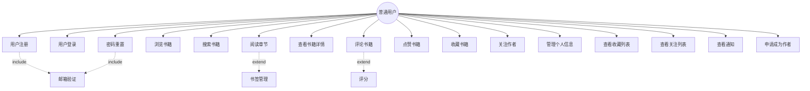
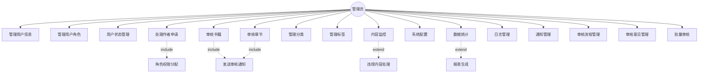
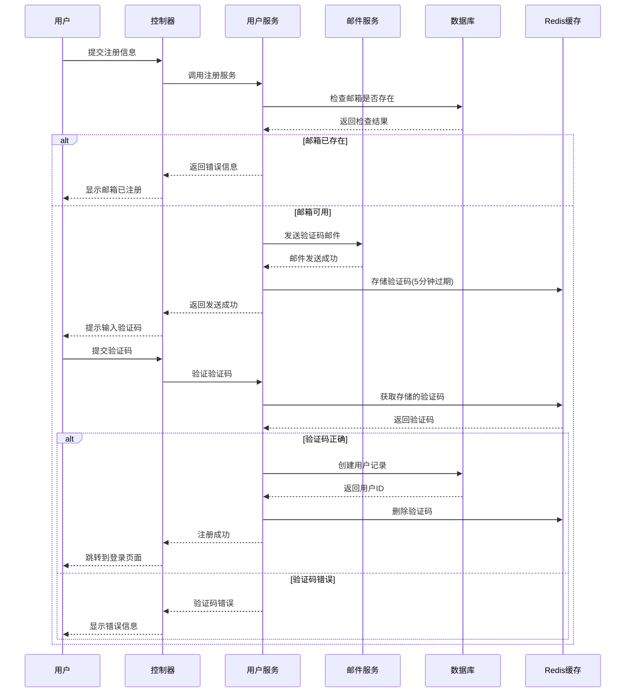
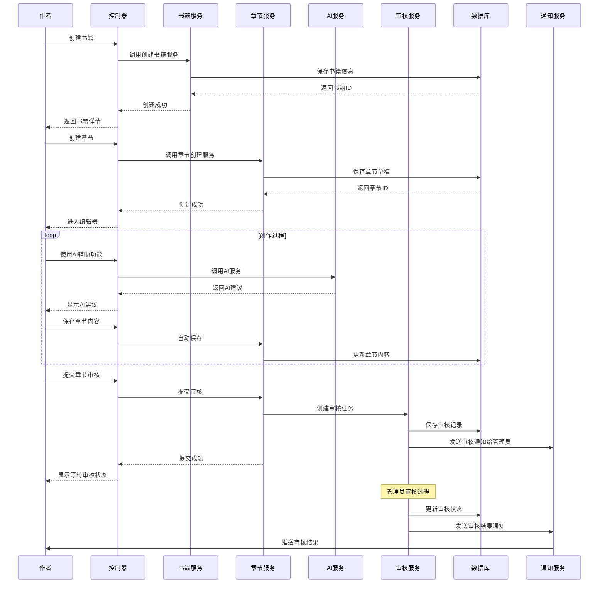
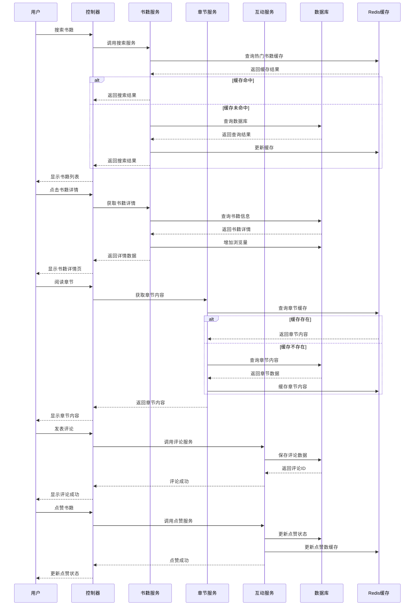
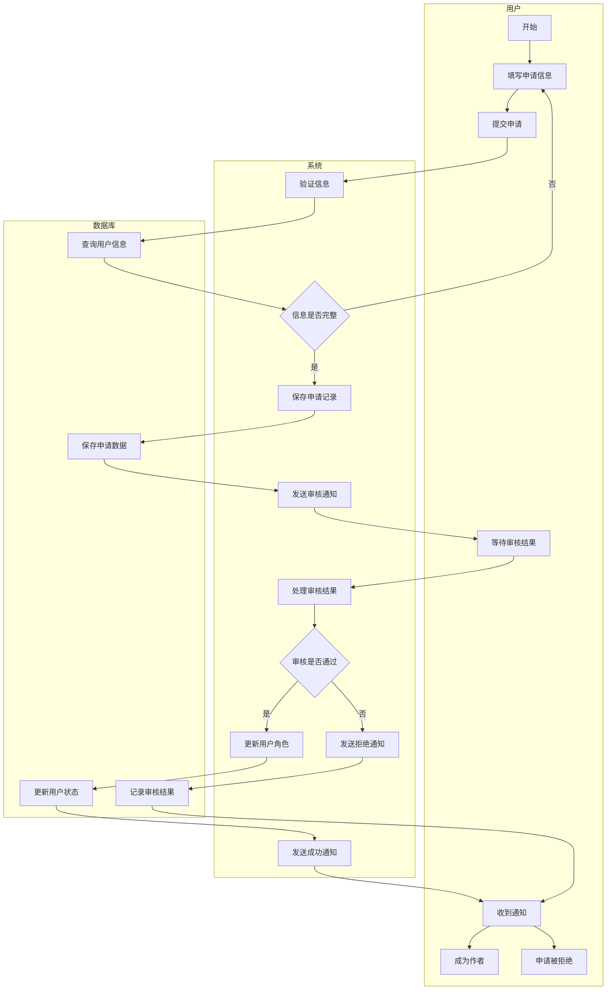
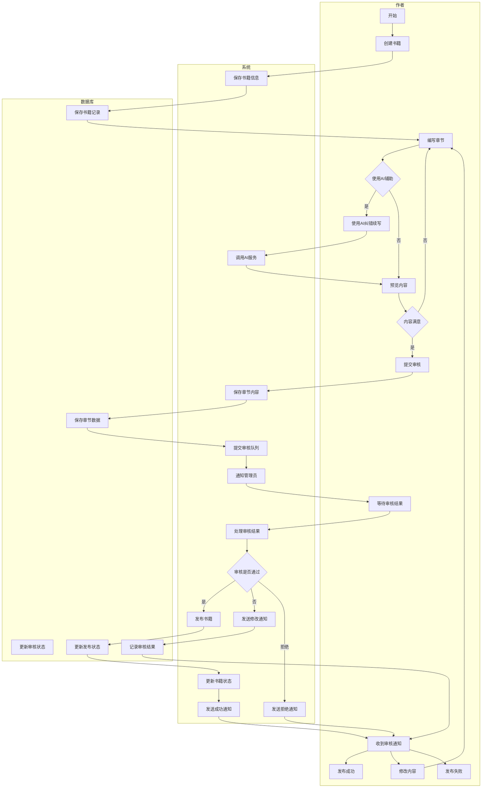
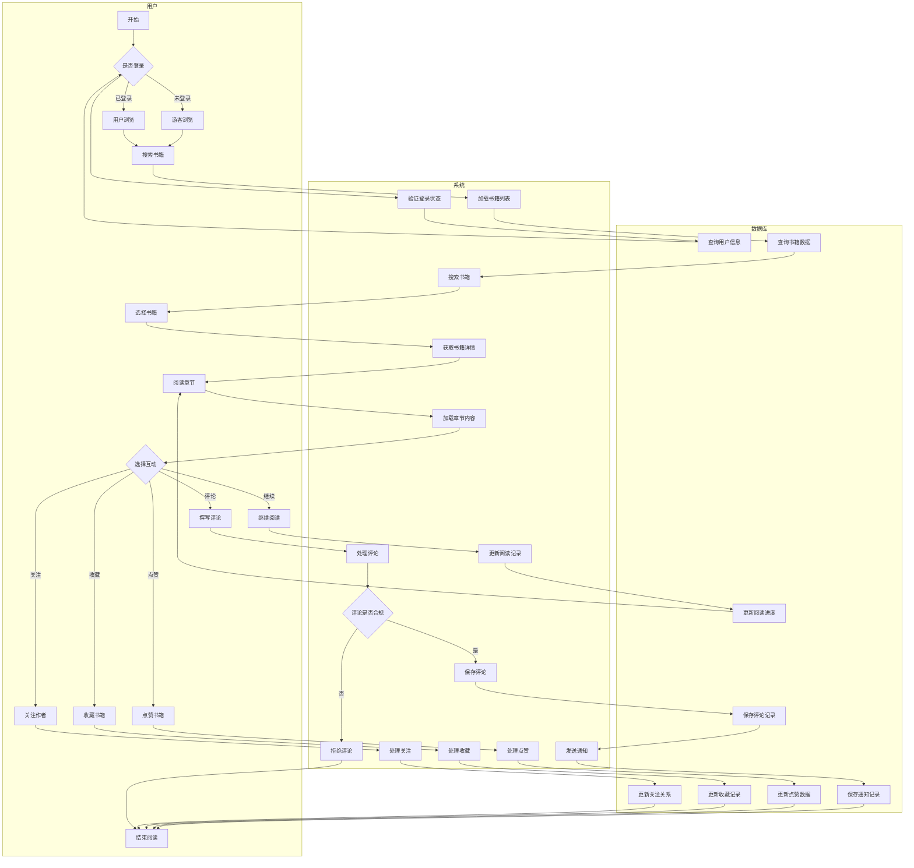

# 大连科技学院

# 系统分析与设计实训

## 实训题目："阅创集" 小说阅读与创作一体化平台


| 学    院 | 大连科技学院      |
| ------ | ----------- |
| 专业班级   | 软件工程 22-6 班 |
| 学生姓名   | 许世豪         |
| 学生学号   | 2206030619  |
| 指导教师   |             |

**完成时间：2025 年 10 月 31 日**


***

## 目录


1. [绪 论](#第1章-绪论)

* [1.1 课题来源及意义](#11-课题来源及意义)

* [1.2 国内外现状](#12-国内外现状)

* [1.3 本课题主要研究的内容](#13-本课题主要研究的内容)

1. [关键技术介绍](#第2章-关键技术介绍)

* [2.1 Java 语言](#21-java语言)

* [2.2 UML 建模语言](#22-uml建模语言)

1. [系统分析](#第3章-系统分析)

* [3.1 需求分析](#31-需求分析)

* [3.2 可行性分析](#32-可行性分析)

* [3.3 用例图](#33-用例图)

* [3.4 用例描述](#34-用例描述)

1. [系统设计](#第4章-系统设计)

* [4.1 系统功能设计](#41-系统功能设计)

* [4.2 系统类图](#42-系统类图)

* [4.3 系统时序图](#43-系统时序图)

* [4.4 系统活动图](#44-系统活动图)

1. [结 论](#第5章-结论)

2. [参考文献](#参考文献)


***

# 第 1 章 绪 论

**说明：** 在绪论中简要说明设计（论文）工作的目的、意义、范围、研究方法、选题依据等。应当言简意赅，不要与摘要雷同。一般教科书中有的知识，在绪论中不必出现。有关历史回顾和前人工作的，可以适当综合评述。

中国的移动互联网在最近几年得到了快速发展，共享经济也即将成为下一个新租赁形态的经济生态模式，共享经济产生是多方面因素共同作用的结果，支撑共享经济的要素包含了硬件、软件、技术、经济和行为习惯等众多必要条件。政府政策的支持，国家发改委联合八部委推动 "共享经济" 国家战略，第十八届五中全会首提 "共享经济"，共享经济已列为国家战略。在政府工作报告中强调，要大力推动包括共享经济在内的 "新经济" 领域快速的发展 \[1]。

## 1.1 课题来源及意义

在数字化时代背景下，阅读与创作的方式正在发生深刻变革。据中国音像与数字出版协会发布的《2024 年度中国数字阅读报告》显示，2024 年我国数字阅读市场总营收规模达 661.41 亿元，同比增长 16.65%；用户规模突破 5.3 亿人，较 2023 年增加约 4800 万人。这一数据充分表明，数字阅读已成为全民阅读不可或缺的重要组成部分。

然而，当前市场上的阅读平台与创作平台大多相互独立，缺乏有效的整合。读者在阅读过程中产生的创作灵感难以得到及时的记录和表达，创作者也难以获得读者的即时反馈和互动。这种分离状态不仅影响了用户体验，也限制了内容生态的健康发展。

"阅创集" 阅读与创作一体化平台的设计与实现，正是为了解决这一痛点问题。该平台将阅读功能与创作功能有机结合，为用户提供一站式的文学体验。用户可以在阅读过程中随时记录感悟、批注点评，也可以基于阅读内容进行二次创作和分享。这种一体化的设计理念，不仅能够提升用户的阅读体验和创作效率，还能够促进优质内容的传播和创新。

从教育角度来看，该平台有助于培养用户的深度阅读能力和创新思维。通过边读边写的方式，用户能够更好地理解和消化阅读内容，同时也能够锻炼自己的表达能力和创作技巧。从文化传播来看，平台为优秀文学作品的传播提供了新的渠道和方式，有助于推动文化的传承和创新。

## 1.2 国内外现状

在国内，数字阅读产业近年来发展迅速。掌阅科技、阅文集团、中文在线等企业在数字阅读领域占据主导地位。掌阅科技以 "让创作点亮美好时光" 为使命，构建了以数字阅读为基础、IP 衍生开发为核心的多模态内容生产运营平台。阅文集团依托其丰富的 IP 储备与成熟的版权运营体系，在网络文学领域继续保持领先地位。

然而，目前国内的阅读平台在创作功能方面还相对薄弱，主要以内容展示和阅读为主，缺乏深度的创作工具和互动功能。一些创作平台虽然提供了在线写作功能，但与阅读功能的整合度不高，用户体验有待提升。

国外在阅读与创作一体化平台方面起步较早，发展相对成熟。亚马逊的 Kindle 平台不仅提供了丰富的电子书资源，还支持用户在阅读过程中添加笔记、标注和评论。Goodreads 作为全球最大的读书社区，将阅读分享与社交功能完美结合，用户可以推荐书籍、撰写书评、参与读书讨论。此外，Medium、Wattpad 等平台也在阅读与创作的融合方面做出了nexploits。

## 1.3 本课题主要研究的内容

本课题是基于 Spring Boot + Vue.js 架构开发的"阅创集"小说阅读与创作一体化平台，在 IntelliJ IDEA 环境下与 MySQL 数据库结合，完成搭建一个集阅读、创作、社交于一体的文学平台。采用前后端分离的架构设计，后端使用 Spring Boot、MyBatis-Plus、Spring Security 等技术栈，前端使用 Vue.js、Element Plus 等现代化框架进行开发。其主要研究的内容有：

（1）**用户认证与权限管理模块**：实现用户注册、登录、邮箱验证、密码重置等功能，支持基于角色的权限控制（RBAC），包括普通用户、作者、编辑、管理员等不同角色。

（2）**书籍创作与管理模块**：提供完整的书籍创作功能，包括书籍信息管理、章节编辑、富文本编辑器集成、自动保存、版本管理等功能，支持作者进行在线创作。

（3）**阅读与互动模块**：实现书籍浏览、章节阅读、评论点赞、书籍收藏、作者关注等社交功能，为读者提供良好的阅读体验和互动环境。

（4）**AI辅助创作模块**：集成DeepSeek AI服务，提供智能纠错、内容续写、情节建议等AI辅助功能，帮助作者提升创作效率和质量。

（5）**创作辅助工具模块**：提供人物设定管理、情节大纲梳理等创作辅助工具，帮助作者更好地组织和管理创作内容。

（6）**内容审核与管理模块**：实现书籍和章节的审核流程，支持编辑对内容进行审核，确保平台内容质量和合规性。

（7）**通知与消息模块**：提供系统通知、审核通知、互动通知等消息推送功能，保持用户与平台的良好互动。

（8）**分类标签管理模块**：实现书籍分类和标签系统，支持多维度的内容组织和检索，提升用户发现内容的效率。

（9）**文件管理模块**：提供统一的文件上传、存储、管理功能，支持头像、封面等多媒体内容的处理。

（10）**系统管理模块**：提供完整的后台管理功能，包括用户管理、内容管理、系统配置、数据统计等管理员功能。


***

# 第 2 章 关键技术介绍

本章对"阅创集"平台开发过程中涉及的关键技术进行简要介绍，包括后端框架、前端技术、数据库技术、AI集成技术等核心技术栈。

## 2.1 Spring Boot 框架

Spring Boot 是基于 Spring 框架的快速开发脚手架，它简化了 Spring 应用的初始搭建以及开发过程。Spring Boot 采用"约定优于配置"的理念，通过自动配置机制大大减少了开发者的配置工作量。

在"阅创集"项目中，Spring Boot 3.5.2 作为后端主框架，提供了以下核心功能：

（1）**自动配置**：自动配置数据源、JPA、Redis、Security 等组件，减少手动配置工作。

（2）**内嵌服务器**：内置 Tomcat 服务器，简化部署流程，支持独立运行。

（3）**健康检查**：提供 Actuator 监控端点，实现应用健康状态监控和性能指标收集。

（4）**依赖管理**：通过 starter 依赖简化第三方库的集成和版本管理。

## 2.2 MyBatis-Plus ORM 框架

MyBatis-Plus 是 MyBatis 的增强工具，在 MyBatis 的基础上只做增强不做改变，为简化开发、提高效率而生。它提供了强大的 CRUD 操作、代码生成器、分页插件等功能。

在项目中的应用特点：

（1）**代码生成**：通过代码生成器自动生成 Entity、Mapper、Service 等基础代码。

（2）**条件构造器**：提供 Wrapper 条件构造器，实现复杂查询条件的构建。

（3）**分页插件**：内置分页插件，支持多种数据库的物理分页。

（4）**性能优化**：支持 SQL 性能分析、执行时间监控等功能。

## 2.3 Spring Security 安全框架

Spring Security 是一个功能强大且高度可定制的身份验证和访问控制框架，为 Spring 应用程序提供全面的安全服务。

项目中的安全实现：

（1）**JWT 认证**：采用 JSON Web Token 实现无状态的用户认证机制。

（2）**角色权限控制**：实现基于角色的访问控制（RBAC），支持用户、作者、编辑、管理员等多种角色。

（3）**密码加密**：使用 BCrypt 算法对用户密码进行加密存储。

（4）**跨域处理**：配置 CORS 策略，支持前后端分离架构的跨域请求。

## 2.4 Vue.js 前端框架

Vue.js 是一套用于构建用户界面的渐进式 JavaScript 框架。它采用自底向上增量开发的设计，核心库只关注视图层，易于上手且便于与第三方库或既有项目整合。

前端技术栈特点：

（1）**组件化开发**：采用单文件组件（SFC）开发模式，提高代码复用性和维护性。

（2）**响应式数据绑定**：通过双向数据绑定实现视图与数据的自动同步。

（3）**路由管理**：使用 Vue Router 实现单页应用的路由管理和页面导航。

（4）**状态管理**：采用 Pinia 进行全局状态管理，实现组件间数据共享。

## 2.5 Redis 缓存技术

Redis 是一个开源的内存数据结构存储系统，可以用作数据库、缓存和消息中间件。它支持多种数据结构，如字符串、哈希、列表、集合等。

在项目中的应用：

（1）**会话管理**：存储用户登录状态和 JWT Token 信息。

（2）**数据缓存**：缓存热点数据，如热门书籍、用户信息等，提高系统响应速度。

（3）**验证码存储**：临时存储邮箱验证码，设置过期时间确保安全性。

（4）**限流控制**：实现 API 调用频率限制，防止恶意请求。

## 2.6 AI 集成技术

项目集成了 DeepSeek AI 服务，为用户提供智能创作辅助功能。通过 RESTful API 调用实现与 AI 服务的交互。

AI 功能实现：

（1）**文本纠错**：利用 AI 模型对用户创作内容进行语法和拼写检查。

（2）**内容续写**：基于已有内容提供智能续写建议，激发创作灵感。

（3）**情节建议**：分析故事情节，提供合理的情节发展建议。

（4）**使用限制**：实现 AI 调用频率限制和用量统计，控制服务成本。


***

# 第 3 章 系统分析

## 3.1 需求分析

"阅创集"小说阅读与创作一体化平台是一个集阅读、创作、社交、管理于一体的综合性文学平台。根据项目需求分析，系统主要包含以下功能模块：

### 3.1.1 功能性需求

**1. 用户认证与权限管理模块**
- 用户注册：支持邮箱验证码注册，包含用户名、密码、邮箱、手机号、昵称等信息
- 用户登录：支持用户名/邮箱登录，JWT Token 认证机制
- 密码管理：支持密码重置、密码修改功能
- 权限控制：基于角色的权限控制（RBAC），支持用户、作者、编辑、管理员等角色

**2. 书籍创作与管理模块**
- 书籍创建：作者可创建书籍，填写标题、简介、分类、标签、封面等信息
- 章节编辑：提供富文本编辑器，支持章节创建、编辑、删除、排序
- 自动保存：编辑过程中自动保存草稿，防止数据丢失
- 状态管理：支持连载、完结、暂停等状态管理

**3. 阅读与互动模块**
- 书籍浏览：支持书籍列表、详情页、章节阅读
- 搜索功能：支持按标题、作者、分类、标签等多维度搜索
- 评论系统：支持书籍评论、评分、点赞功能
- 社交功能：支持关注作者、收藏书籍、粉丝管理

**4. AI辅助创作模块**
- 智能纠错：集成DeepSeek AI，提供文本纠错功能
- 内容续写：基于上下文提供智能续写建议
- 情节建议：分析故事情节，提供发展建议
- 使用限制：实现AI调用频率限制和用量统计

**5. 创作辅助工具模块**
- 人物设定：支持人物信息管理、关系图谱
- 情节大纲：支持章节大纲、情节线管理
- 时间线规划：支持故事时间线管理

**6. 内容审核与管理模块**
- 书籍审核：编辑可对提交的书籍进行审核
- 章节审核：支持章节内容审核流程
- 审核通知：审核结果通知机制

**7. 通知与消息模块**
- 系统通知：系统公告、更新通知
- 互动通知：评论、点赞、关注通知
- 审核通知：审核结果、审核意见通知

**8. 分类标签管理模块**
- 分类管理：支持书籍分类的增删改查
- 标签管理：支持标签系统，多标签关联
- 层级管理：支持分类的层级结构

**9. 文件管理模块**
- 文件上传：支持头像、封面等文件上传
- 文件存储：统一的文件存储和管理
- 文件删除：支持文件删除和批量删除

**10. 系统管理模块**
- 用户管理：管理员可管理用户信息、状态
- 内容管理：管理书籍、章节、评论等内容
- 数据统计：提供用户、内容、访问等统计信息
- 系统配置：系统参数配置和管理

### 3.1.2 非功能性需求

**1. 性能需求**
- 系统响应时间：页面加载时间不超过3秒
- 并发用户数：支持1000个并发用户同时在线
- 数据库查询：复杂查询响应时间不超过1秒

**2. 安全需求**
- 数据加密：用户密码采用BCrypt加密存储
- 访问控制：基于JWT的身份认证和权限控制
- 数据备份：定期数据备份，确保数据安全

**3. 可用性需求**
- 系统可用性：99.5%以上的系统可用性
- 界面友好：直观易用的用户界面设计
- 响应式设计：支持PC端和移动端访问

**4. 可扩展性需求**
- 模块化设计：采用微服务架构，便于功能扩展
- 数据库扩展：支持数据库水平扩展
- 缓存机制：Redis缓存提升系统性能

## 3.2 可行性分析

### 3.2.1 技术可行性分析

"阅创集"平台的技术可行性主要从以下几个方面进行分析：

**1. 技术架 constructing**
项目采用Spring Boot + Vue.js的前后端分离架构，这是目前主流的Web开发架构模式。Spring Boot框架成熟稳定，拥有完善的生态系统和丰富的第三方库支持。Vue.js作为前端框架，具有良好的组件化开发体验和活跃的社区支持。

**2. 数据库技术**
采用MySQL 8.0作为主数据库，MySQL是世界上最流行的开源关系型数据库，具有高性能、高可靠性的特点。配合MyBatis-Plus ORM框架，可以高效地进行数据库操作和管理。

**3. 缓存技术**
Redis作为缓存中间件，可以显著提升系统性能，减少数据库压力。Redis的高性能和丰富的数据结构为系统提供了强大的缓存支持。

**4. AI技术集成**
DeepSeek AI服务提供了成熟的API接口，通过HTTP请求即可实现AI功能集成。技术实现相对简单，风险可控。

### 3.2.2 经济可行性分析

**1. 开发成本**
项目采用开源技术栈，大大降低了软件许可成本。主要成本集中在人力资源和服务器部署方面，成本可控。

**2. 运营成本**
- 服务器成本：采用云服务器部署，可根据实际需求弹性扩展
- AI服务成本：DeepSeek AI按调用次数计费，成本透明可控
- 维护成本：采用成熟技术栈，维护成本相对较低

**3. 投资回报**
作为学习和个人项目，主要价值在于技术积累和经验提升，具有良好的教育投资回报。

### 3.2.3 操作可行性分析

**1. 用户界面设计**
系统采用现代化的UI设计，界面简洁直观，用户学习成本低。响应式设计确保在不同设备上都有良好的用户体验。

**2. 功能易用性**
- 注册登录流程简单，支持邮箱验证
- 创作工具功能丰富但操作简单
- 阅读界面清晰，互动功能便捷

**3. 管理便捷性**
后台管理功能完善，管理员可以方便地进行用户管理、内容管理、系统配置等操作。

### 3.2.4 时间可行性分析

**1. 开发周期**
基于现有的技术积累和框架支持，项目开发周期合理。核心功能已基本实现，后续主要是功能完善和优化。

**2. 技术学习曲线**
采用的技术栈都是主流技术，学习资源丰富，技术学习曲线平缓。

**3. 项目进度**
项目已完成主要功能模块的开发，具备了基本的运行条件，时间安排合理可行。

## 3.3 用例图

### 3.3.1 普通用户用例图

该系统为普通用户（读者）提供以下功能和服务：

（1）用户注册登录：用户填写相关信息进行注册登录
（2）书籍浏览阅读：浏览书籍列表，查看书籍详情，阅读章节内容
（3）互动功能：评论书籍、点赞、收藏书籍、关注作者
（4）个人中心：管理个人信息、查看收藏、关注列表
（5）搜索功能：按多种条件搜索书籍

通过上述功能分析，绘制出普通用户用例图如图 3.1 所示：



**图 3.1 普通用户用例图**

### 3.3.2 作者用例图

该系统中作者具有普通用户的所有功能，同时还具有以下创作相关功能：

（1）书籍管理：创建书籍、编辑书籍信息、管理书籍状态
（2）章节创作：创建章节、编辑章节内容、管理章节
（3）AI辅助创作：使用AI纠错、续写、情节建议功能
（4）创作辅助工具：人物设定管理、情节大纲管理
（5）作品数据：查看作品统计、读者反馈

通过上述功能分析，绘制出作者用例图如图 3.2 所示：

```mermaid
graph TB
    Author((作者))
    
    %% 继承普通用户功能
    Author --> UC20[普通用户功能]
    
    %% 书籍管理用例
    Author --> UC21[创建书籍]
    Author --> UC22[编辑书籍信息]
    Author --> UC23[管理书籍状态]
    Author --> UC24[删除书籍]
    
    %% 章节创作用例
    Author --> UC25[创建章节]
    Author --> UC26[编辑章节]
    Author --> UC27[删除章节]
    Author --> UC28[章节排序]
    
    %% AI辅助创作用例
    Author --> UC29[AI文本纠错]
    Author --> UC30[AI内容续写]
    Author --> UC31[AI情节建议]
    
    %% 创作辅助工具用例
    Author --> UC32[人物设定管理]
    Author --> UC33[情节大纲管理]
    Author --> UC34[时间线规划]
    
    %% 数据统计用例
    Author --> UC35[查看作品统计]
    Author --> UC36[查看读者反馈]
    
    %% 提交审核用例
    Author --> UC37[提交书籍审核]
    Author --> UC38[提交章节审核]
    
    %% 用例之间的关系
    UC21 -.->|include| UC39[上传封面]
    UC25 -.->|include| UC40[富文本编辑]
    UC26 -.->|include| UC40
    UC26 -.->|include| UC41[自动保存]
    UC29 -.->|extend| UC42[批量纠错]
    UC30 -.->|extend| UC43[多段续写]
```



**图 3.2 作者用例图**

### 3.3.3 管理员用例图

该系统中管理员具有最高权限，可以进行系统管理和内容管理：

（1）用户管理：管理用户信息、角色权限、用户状态
（2）内容管理：审核书籍、管理分类标签、内容监控
（3）系统管理：系统配置、数据统计、日志管理
（4）审核管理：处理审核申请、管理审核流程

通过上述功能分析，绘制出管理员用例图如图 3.3 所示：



**图 3.3 管理员用例图**

## 3.4 用例描述

以下是阅创集平台核心用例的详细描述：

### 3.4.1 用户注册用例描述

| 用例名称：用户注册                           |
| ----------------------------------- |
| **执行者：** 访客                         |
| **简要说明：**                           |
| 访客通过填写注册信息并验证邮箱完成用户注册               |
| **前置条件：**                           |
| 访客访问注册页面                            |
| **基本事件流：**                          |
| 1. 访客进入注册页面，填写用户名、邮箱、密码、确认密码等信息     |
| 2. 系统验证信息格式和完整性                     |
| 3. 系统检查邮箱是否已被注册                     |
| 4. 系统发送验证码到用户邮箱                     |
| 5. 用户输入收到的验证码                       |
| 6. 系统验证验证码正确性                       |
| 7. 系统创建用户账户，提示注册成功                  |
| 8. 系统跳转到登录页面                        |
| **异常事件流：**                          |
| 3a. 邮箱已被注册：系统提示邮箱已存在，返回步骤1          |
| 5a. 验证码错误：系统提示验证码错误，允许重新输入          |
| 5b. 验证码过期：系统提示验证码过期，允许重新发送          |
| **后置条件：**                           |
| 用户账户创建成功，可以使用邮箱和密码登录               |

### 3.4.2 书籍创作用例描述

| 用例名称：书籍创作                           |
| ----------------------------------- |
| **执行者：** 作者                         |
| **简要说明：**                           |
| 作者创建书籍并编写章节内容，可使用AI辅助功能进行创作        |
| **前置条件：**                           |
| 用户已登录且具有作者权限                        |
| **基本事件流：**                          |
| 1. 作者进入创作中心，点击"创建新书"                |
| 2. 系统显示书籍信息填写页面                     |
| 3. 作者填写书籍标题、简介、分类、封面等信息             |
| 4. 系统保存书籍信息，创建书籍记录                  |
| 5. 作者进入章节编辑器，开始创作第一章                |
| 6. 作者使用富文本编辑器编写章节内容                 |
| 7. 作者可选择使用AI辅助功能（纠错、续写、情节建议）        |
| 8. 系统自动保存章节草稿                       |
| 9. 作者完成章节编写，点击"提交审核"                |
| 10. 系统创建审核任务，通知管理员                  |
| 11. 系统显示章节状态为"审核中"                  |
| **异常事件流：**                          |
| 3a. 书籍信息不完整：系统提示必填项，返回步骤3           |
| 7a. AI服务不可用：系统提示AI功能暂时不可用，作者可继续手动编写 |
| 9a. 章节内容为空：系统提示章节内容不能为空，返回步骤6      |
| **后置条件：**                           |
| 书籍和章节创建成功，等待管理员审核                 |

### 3.4.3 书籍阅读用例描述

| 用例名称：书籍阅读                           |
| ----------------------------------- |
| **执行者：** 普通用户                       |
| **简要说明：**                           |
| 用户浏览和阅读平台上的书籍内容，可进行互动操作             |
| **前置条件：**                           |
| 用户访问平台（登录或未登录状态）                    |
| **基本事件流：**                          |
| 1. 用户进入平台首页或搜索页面                    |
| 2. 用户浏览书籍列表或使用搜索功能查找书籍              |
| 3. 用户点击感兴趣的书籍，进入书籍详情页               |
| 4. 系统显示书籍信息、章节列表、评论等内容              |
| 5. 用户选择章节开始阅读                       |
| 6. 系统显示章节内容，记录阅读进度                  |
| 7. 用户可进行互动操作（评论、点赞、收藏、关注作者）        |
| 8. 用户可继续阅读下一章节或返回书籍详情页              |
| **异常事件流：**                          |
| 7a. 用户未登录进行互动：系统提示登录，跳转到登录页面        |
| 5a. 章节需要付费：系统提示付费信息（如果有付费功能）        |
| **后置条件：**                           |
| 阅读记录被保存，用户互动数据更新                    |

### 3.4.4 内容审核用例描述

| 用例名称：内容审核                           |
| ----------------------------------- |
| **执行者：** 管理员                        |
| **简要说明：**                           |
| 管理员审核作者提交的书籍和章节内容                   |
| **前置条件：**                           |
| 管理员已登录，存在待审核的内容                     |
| **基本事件流：**                          |
| 1. 管理员进入审核管理页面                      |
| 2. 系统显示待审核内容列表                      |
| 3. 管理员选择待审核的书籍或章节                   |
| 4. 系统显示内容详情和审核界面                    |
| 5. 管理员阅读内容，检查是否符合平台规范               |
| 6. 管理员选择审核结果（通过/拒绝/需要修改）            |
| 7. 管理员填写审核意见                        |
| 8. 系统保存审核结果，更新内容状态                  |
| 9. 系统发送审核结果通知给作者                    |
| **异常事件流：**                          |
| 6a. 内容违规：管理员选择拒绝，填写违规原因             |
| 6b. 内容需要修改：管理员选择需要修改，提供修改建议         |
| **后置条件：**                           |
| 审核结果保存，作者收到审核通知，内容状态更新             |


***

# 第 4 章 系统设计

## 4.1 系统功能设计

阅创集创作与阅读一体化平台根据系统分析可以将系统模块分为三个主要部分：普通用户模块、作者模块和管理员模块。系统功能结构如图 4.1 所示：

```mermaid
graph TB
    System[阅创集平台]
    
    %% 普通用户模块
    System --> UserModule[普通用户模块]
    UserModule --> UserAuth[用户认证]
    UserModule --> BookBrowse[书籍浏览]
    UserModule --> BookRead[阅读功能]
    UserModule --> UserInteract[互动功能]
    UserModule --> UserCenter[个人中心]
    
    UserAuth --> Register[用户注册]
    UserAuth --> Login[用户登录]
    UserAuth --> ResetPwd[密码重置]
    
    BookBrowse --> BookList[书籍列表]
    BookBrowse --> BookSearch[书籍搜索]
    BookBrowse --> BookDetail[书籍详情]
    
    BookRead --> ChapterRead[章节阅读]
    BookRead --> Bookmark[书签管理]
    BookRead --> ReadHistory[阅读历史]
    
    UserInteract --> Comment[评论书籍]
    UserInteract --> Like[点赞收藏]
    UserInteract --> Follow[关注作者]
    
    UserCenter --> ProfileMgmt[个人信息管理]
    UserCenter --> CollectionMgmt[收藏管理]
    UserCenter --> NotificationMgmt[通知管理]
    UserCenter --> AuthorApply[作者申请]
    
    %% 作者模块
    System --> AuthorModule[作者模块]
    AuthorModule --> BookMgmt[书籍管理]
    AuthorModule --> ChapterMgmt[章节管理]
    AuthorModule --> AIAssist[AI辅助创作]
    AuthorModule --> CreativeTools[创作工具]
    AuthorModule --> DataStats[数据统计]
    
    BookMgmt --> CreateBook[创建书籍]
    BookMgmt --> EditBook[编辑书籍]
    BookMgmt --> BookStatus[状态管理]
    
    ChapterMgmt --> CreateChapter[创建章节]
    ChapterMgmt --> EditChapter[编辑章节]
    ChapterMgmt --> ChapterOrder[章节排序]
    
    AIAssist --> TextCorrect[文本纠错]
    AIAssist --> ContentContinue[内容续写]
    AIAssist --> PlotSuggest[情节建议]
    
    CreativeTools --> CharacterMgmt[人物设定]
    CreativeTools --> PlotOutline[情节大纲]
    CreativeTools --> Timeline[时间线规划]
    
    %% 管理员模块
    System --> AdminModule[管理员模块]
    AdminModule --> UserMgmt[用户管理]
    AdminModule --> ContentMgmt[内容管理]
    AdminModule --> SystemMgmt[系统管理]
    AdminModule --> ReviewMgmt[审核管理]
    
    UserMgmt --> UserInfo[用户信息管理]
    UserMgmt --> RoleMgmt[角色权限管理]
    UserMgmt --> AuthorReview[作者申请审核]
    
    ContentMgmt --> BookReview[书籍审核]
    ContentMgmt --> ChapterReview[章节审核]
    ContentMgmt --> CategoryMgmt[分类管理]
    ContentMgmt --> TagMgmt[标签管理]
    
    SystemMgmt --> SysConfig[系统配置]
    SystemMgmt --> DataAnalysis[数据分析]
    SystemMgmt --> LogMgmt[日志管理]
    
    ReviewMgmt --> ReviewProcess[审核流程]
    ReviewMgmt --> ReviewComment[审核意见]
    ReviewMgmt --> BatchReview[批量审核]
```



**图 4.1 系统功能结构图**

## 4.2 系统类图

在阅创集平台系统设计中，主要包含以下核心类：用户类、书籍类、章节类、评论类、通知类、审核类等。这些类之间通过继承、关联、聚合等关系构成完整的系统架构。核心类图如图 4.2 所示：

```mermaid
classDiagram
    %% 用户相关类
    class User {
        -Long userId
        -String username
        -String email
        -String password
        -String nickname
        -String avatar
        -UserRole role
        -UserStatus status
        -Date createTime
        -Date updateTime
        +login(String email, String password) Boolean
        +register(UserRegisterDto dto) Boolean
        +updateProfile(UserProfileDto dto) Boolean
        +resetPassword(String email, String newPassword) Boolean
    }
    
    class Author {
        -String penName
        -String bio
        -String contact
        -AuthorStatus status
        -Date applyTime
        -Date approveTime
        +createBook(BookCreateDto dto) Book
        +publishChapter(ChapterDto dto) Chapter
        +getBookStats(Long bookId) BookStats
    }
    
    class Admin {
        -AdminRole adminRole
        -String permissions
        +reviewBook(Long bookId, ReviewDto dto) Boolean
        +reviewAuthorApply(Long userId, Boolean approve) Boolean
        +manageUser(Long userId, UserManageDto dto) Boolean
    }
    
    %% 书籍相关类
    class Book {
        -Long bookId
        -String title
        -String description
        -String coverUrl
        -Long authorId
        -BookStatus status
        -BookCategory category
        -Integer chapterCount
        -Integer viewCount
        -Integer likeCount
        -Date createTime
        -Date updateTime
        +addChapter(Chapter chapter) Boolean
        +updateStatus(BookStatus status) Boolean
        +getChapterList() List~Chapter~
    }
    
    class Chapter {
        -Long chapterId
        -Long bookId
        -String title
        -String content
        -Integer chapterOrder
        -ChapterStatus status
        -Integer wordCount
        -Date createTime
        -Date publishTime
        +updateContent(String content) Boolean
        +publish() Boolean
        +getWordCount() Integer
    }
    
    class Category {
        -Long categoryId
        -String categoryName
        -String description
        -Integer bookCount
        +addBook(Book book) Boolean
        +getBookList() List~Book~
    }
    
    %% 互动相关类
    class Comment {
        -Long commentId
        -Long bookId
        -Long userId
        -String content
        -Integer rating
        -CommentStatus status
        -Date createTime
        +reply(String content) Comment
        +like() Boolean
        +report() Boolean
    }
    
    class Like {
        -Long likeId
        -Long userId
        -Long bookId
        -LikeType type
        -Date createTime
        +toggle() Boolean
    }
    
    class Follow {
        -Long followId
        -Long followerId
        -Long authorId
        -Date createTime
        +unfollow() Boolean
    }
    
    %% 系统功能类
    class Notification {
        -Long notificationId
        -Long userId
        -String title
        -String content
        -NotificationType type
        -Boolean isRead
        -Date createTime
        +markAsRead() Boolean
        +delete() Boolean
    }
    
    class Review {
        -Long reviewId
        -Long targetId
        -ReviewType type
        -ReviewStatus status
        -String reviewComment
        -Long reviewerId
        -Date createTime
        -Date reviewTime
        +approve(String comment) Boolean
        +reject(String reason) Boolean
    }
    
    class AIService {
        -String apiKey
        -String baseUrl
        +correctText(String text) String
        +continueContent(String context) String
        +suggestPlot(String outline) String
    }
    
    %% 类之间的关系
    User <|-- Author
    User <|-- Admin
    
    Author ||--o{ Book
    Book ||--o{ Chapter
    Book }o--|| Category
    
    User ||--o{ Comment
    User ||--o{ Like
    User ||--o{ Follow
    User ||--o{ Notification
    
    Book ||--o{ Comment
    Book ||--o{ Like
    Book ||--o{ Review
    Chapter ||--o{ Review
    
    Admin ||--o{ Review
    Author ||--o{ AIService
```

**图 4.2 系统核心类图**

## 4.3 系统时序图

时序图详细描述了系统中关键业务流程的交互过程，展现了对象之间的消息传递和时间顺序。以下是三个核心业务的时序图：

### 4.3.1 用户注册时序图



**图 4.3 用户注册时序图**

### 4.3.2 书籍创作发布时序图



**图 4.4 书籍创作发布时序图**

### 4.3.3 书籍阅读互动时序图



**图 4.5 书籍阅读互动时序图**

## 4.4 系统活动图

活动图描述了系统中关键业务流程的控制流和决策点，清晰展现了业务逻辑的执行路径。以下是三个核心业务的活动图：

### 4.4.1 作者申请审核活动图



**图 4.6 作者申请审核活动图**

### 4.4.2 书籍发布审核活动图



**图 4.7 书籍发布审核活动图**

### 4.4.3 用户阅读互动活动图



**图 4.8 用户阅读互动活动图**


***

# 第 5 章 结 论

本报告详细分析和设计了阅创集创作与阅读一体化平台，该平台是一个集创作、阅读、互动于一体的综合性文学平台。通过系统的需求分析、技术选型、架构设计和详细设计，形成了完整的系统解决方案。

## 5.1 研究成果总结

在技术架构方面，本研究采用了前后端分离的现代化架构设计理念，后端基于Spring Boot框架构建，前端使用Vue.js技术栈，实现了高内聚、低耦合的系统架构。通过引入Redis缓存技术提升数据访问性能，采用MyBatis-Plus ORM框架简化数据库操作，集成DeepSeek AI服务提供智能化功能支持，整体技术架构既保证了系统的稳定性和可扩展性，又体现了现代Web应用开发的最佳实践。

在功能模块设计上，系统构建了完整的功能体系，涵盖用户认证与权限管理、书籍创建与管理、章节编写与发布、AI辅助创作、内容审核与监管、用户互动与社交等核心业务模块。这些模块相互协作，形成了从用户注册、作者申请、内容创作、审核发布到读者阅读、互动反馈的完整业务闭环，满足了平台各类用户的差异化需求。

在数据库设计层面，建立了规范化的数据模型，通过科学的表结构设计和合理的关系映射，确保了数据的一致性、完整性和安全性。数据库设计充分考虑了业务扩展需求，为系统的长期发展提供了坚实的数据基础。

在技术创新方面，系统创新性地集成了AI辅助创作功能，包括智能文本纠错、内容续写建议、情节发展提示等特色功能。这些AI功能的引入不仅提升了作者的创作效率，降低了创作门槛，还为平台带来了独特的竞争优势，体现了传统文学创作与现代人工智能技术的深度融合。

## 5.2 系统特色与优势

阅创集平台的核心优势在于其一体化的设计理念，将传统的创作和阅读功能进行深度整合，为用户提供了从灵感产生、内容创作、作品发布到读者阅读、互动反馈的完整体验链条。这种一体化设计打破了传统文学平台创作与阅读分离的局限，创造了更加丰富和连贯的用户体验。

AI技术的深度应用是平台的另一大特色。通过集成先进的人工智能服务，平台为作者提供了智能化的创作辅助工具，包括实时的文本纠错、基于上下文的内容续写建议、情节发展提示等功能。这些AI功能不仅提升了创作效率，还能够激发作者的创作灵感，为文学创作注入了新的活力。

在内容质量管控方面，平台建立了完善的多层次审核机制，通过系统自动检测与人工审核相结合的方式，确保平台内容的质量和合规性。这种审核机制既保证了内容的健康性，又维护了良好的创作和阅读环境，为平台的可持续发展奠定了基础。

权限管理系统的设计体现了平台的灵活性和专业性。通过细粒度的用户角色划分和权限控制，系统能够支持普通读者、创作作者、内容编辑、系统管理员等不同角色的差异化功能需求，确保每个用户都能获得最适合其身份的功能体验。

通过本次系统分析与设计实训，不仅深入理解了软件工程的完整开发流程，掌握了现代Web应用的设计方法和技术实现，更重要的是学会了如何将理论知识与实际项目需求相结合，为今后的软件开发工作奠定了坚实的理论基础和实践经验。

***

# 参考文献

\[1] 廖雪峰. Spring Boot实战 \[M]. 电子工业出版社，2020.

\[2] 尤雨溪. Vue.js权威指南 \[M]. 人民邮电出版社，2019.

\[3] 张开涛. Spring Boot + Vue全栈开发实战 \[M]. 机械工业出版社，2021.

\[4] MyBatis-Plus官方文档 \[EB/OL]. https://baomidou.com/, 2023.

\[5] Spring Security官方文档 \[EB/OL]. https://spring.io/projects/spring-security, 2023.

\[6] Redis设计与实现 \[M]. 机械工业出版社，2014.

\[7] 阿里巴巴Java开发手册 \[M]. 电子工业出版社，2022.

\[8] 马丁·福勒. 企业应用架构模式 \[M]. 机械工业出版社，2004.

\[9] 埃里克·埃文斯. 领域驱动设计 \[M]. 人民邮电出版社，2010.

\[10] DeepSeek AI官方文档 \[EB/OL]. https://www.deepseek.com/, 2024.

\[11] 腾讯云开发者. 微服务架构设计模式 \[M]. 电子工业出版社，2021.

\[12] 张亮，曹昊. 分布式数据库架构及企业实践 \[M]. 机械工业出版社，2020.

\[13] Element Plus官方文档 \[EB/OL]. https://element-plus.org/, 2023.

\[14] Axios HTTP客户端文档 \[EB/OL]. https://axios-http.com/, 2023.

\[15] JWT官方规范 \[EB/OL]. https://jwt.io/, 2023.


***

# 信息科学与技术学院

# 评阅表


| 教师评阅             | 评阅项目                               | 评阅标准 | 得分 |
| ---------------- | ---------------------------------- | ---- | -- |
| **绪论（20 分）**     |                                    |      |    |
|                  | A：背景清晰、目标明确，逻辑严谨，体现面向对象思想（17-20 分） |      |    |
|                  | B：背景完整，目标较明确，逻辑较清晰（13-16 分）        |      |    |
|                  | C：背景较模糊，目标笼统，逻辑一般（9-12 分）          |      |    |
|                  | D：背景缺失，目标不明确，逻辑一般（5-8 分）           |      |    |
|                  | E：内容空洞，与项目无关，逻辑严重错误（0-4 分）         |      |    |
| **关键技术介绍（20 分）** |                                    |      |    |
|                  | A：技术选型合理，原理清晰，结合项目需求分析（17-20 分）    |      |    |
|                  | B：技术选型较合理，原理较清晰，但关联性弱（13-16 分）     |      |    |
|                  | C：技术罗列为主，原理描述浅，关联性差（9-12 分）        |      |    |
|                  | D：技术描述简略，未结合项目需求（5-8 分）            |      |    |
|                  | E：技术介绍缺失，或与项目无关（0-4 分）             |      |    |
| **系统分析（20 分）**   |                                    |      |    |
|                  | A：需求完整，用例图清晰，分析过程严谨（17-20 分）       |      |    |
|                  | B：需求较完整，用例图基本清晰，分析较合理（13-16 分）     |      |    |
|                  | C：需求较完整，用例图模糊，分析逻辑较弱（9-12 分）       |      |    |
|                  | D：需求少量缺失，用例图有少量错误，分析关联性弱（5-8 分）    |      |    |
|                  | E：需求分析严重缺失或错误（0-4 分）               |      |    |
| **系统设计（40 分）**   |                                    |      |    |
|                  | A：类图、动态图完整，设计合理，扩展性强（33-40 分）      |      |    |
|                  | B：类图、动态图较完整，设计较合理，扩展性一般（25-32 分）   |      |    |
|                  | C：类图、动态图较完整，设计存在较少缺陷（17-24 分）      |      |    |
|                  | D：类图、动态图有少量缺失，设计存在少量不合理（9-16 分）    |      |    |
|                  | E：设计完全较多缺失或与需求脱节（0-8 分）            |      |    |
| **评分**           |                                    |      |    |
| **教师签字**         |                                    |      |    |
| **日期**           |                                    |      |    |

